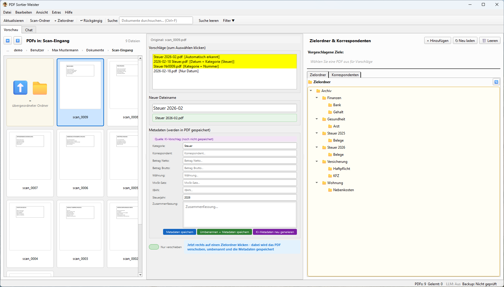

# PDF Sortier Meister

**Gescannte PDFs sortieren, umbenennen und wiederfinden — auf dem eigenen PC (Windows & macOS), ohne Server, mit lokaler KI.**

[](https://github.com/Josi-create/PDF_Sortier_Meister/releases/latest)
[](https://github.com/Josi-create/PDF_Sortier_Meister/releases)


[](LICENSE)



Der Scanner legt `scan_0042.pdf` ab — und dann? PDF Sortier Meister zeigt die Scans als
Vorschau, schlägt Zielordner und einen sprechenden Dateinamen vor, schreibt Kategorie,
Betrag und Steuerjahr als Metadaten **in die PDF selbst** und lernt aus jeder Entscheidung.
Die Dateien bleiben ganz normale PDFs in ganz normalen Ordnern (auch OneDrive) — kein
Datenbank-Silo, kein Docker, kein Server.

> 🧪 **Beta — Tester gesucht!** Das Programm ist funktionsfähig und wird täglich benutzt,
> aber bisher nur von wenigen Leuten. Wenn du Belege scannst und Ordnung willst, probier es
> aus und sag mir, was nervt. Siehe [Beta-Tester werden](#-beta-tester-werden).

---

## ⚡ Installation

### Windows

1. **Herunterladen:** 👉 [`PDF_Sortier_Meister_Setup.exe`](https://github.com/Josi-create/PDF_Sortier_Meister/releases/latest/download/PDF_Sortier_Meister_Setup.exe) — dieser Link zeigt immer auf die **neueste Version**
2. **Doppelklick** auf die Setup-Datei → Weiter → Fertig
3. Beim ersten Start führt der Einrichtungs-Assistent durch Scan-Ordner, Zielordner und (optional) KI-Anbieter.

Texterkennung (OCR, Tesseract) ist **enthalten** — Scans ohne Textebene funktionieren ohne weitere Installation.

**Update:** Neue Version einfach über die alte drüberinstallieren (gleicher Link oben) — Einstellungen und
Lerndaten bleiben dabei erhalten, Reste der Vorversion werden automatisch aufgeräumt.

**Deinstallation:** Wie gewohnt über *Windows-Einstellungen → Apps* (bzw. *Apps & Features*). Einstellungen und
Lerndaten bleiben dabei absichtlich erhalten (praktisch bei Neuinstallation); wer alles restlos entfernen
möchte, löscht danach noch den Ordner `%APPDATA%\PDF_Sortier_Meister`.

> 🛡️ **Windows SmartScreen warnt?** *„Weitere Informationen“ → „Trotzdem ausführen“.* Das passiert bei
> unsignierten Programmen — der Quellcode ist hier öffentlich einsehbar.
>
> 📦 **Lieber ohne Installation?** Auf der [Release-Seite](https://github.com/Josi-create/PDF_Sortier_Meister/releases/latest)
> liegt auch ein portables ZIP: entpacken, `PDF_Sortier_Meister.exe` starten.

### macOS

1. **Herunterladen** (je nach Chip, siehe * → Über diesen Mac*):
   - Apple Silicon (M1–M4): 👉 [`PDF_Sortier_Meister-macos-arm64.dmg`](https://github.com/Josi-create/PDF_Sortier_Meister/releases/latest/download/PDF_Sortier_Meister-macos-arm64.dmg)
   - Intel: 👉 [`PDF_Sortier_Meister-macos-x86_64.dmg`](https://github.com/Josi-create/PDF_Sortier_Meister/releases/latest/download/PDF_Sortier_Meister-macos-x86_64.dmg)
2. DMG öffnen, **„PDF Sortier Meister" auf „Applications" ziehen**, fertig.
3. Beim ersten Start führt der Einrichtungs-Assistent durch Scan-Ordner, Zielordner und (optional) KI-Anbieter.

Texterkennung (OCR, Tesseract) ist auch hier **enthalten**. Einstellungen und Lerndaten liegen unter
`~/Library/Application Support/PDF_Sortier_Meister`.

---

## Was das Programm kann

### Sortieren wie im Explorer, nur mit Vorschlägen
- **Scan-Ordner als Dateimanager**: Ordner-Kacheln, Breadcrumb, `Alt+↑`, Doppelklick in Unterordner,
  Kachelgröße Klein / Mittel / Groß wie im Explorer (kleine Kacheln zeigen beim Überfahren die große Vorschau)
- **Zielordner-Vorschläge** aus dem PDF-Inhalt, lernend (TF-IDF, lokal, offline) — grün hervorgehoben.
  Erkennt das Jahr im Dokument, wird z. B. neben `Steuer 2025/Belege` auch `Steuer 2026/Belege` angeboten
- **Ein Klick** auf den Zielordner verschiebt, benennt um und speichert die Metadaten in einem Rutsch;
  **„Nur verschieben“**-Schalter, wenn der Dateiname bleiben soll
- **Drag & Drop**, Mehrfachauswahl (Shift/Ctrl+Klick), **Rückgängig** (`Ctrl+Z`), Kopie in mehrere Ordner
- **Explorer-Kontextmenü**: Rechtsklick auf einen Ordner oder eine PDF → „PDF Sortier Meister von hier öffnen“

### Umbenennen mit Verstand
- Vorschläge aus erkanntem **Datum** (12.03.2026, „März 2026“, ISO), **Kategorie** (Rechnung, Vertrag,
  Versicherung, Bank, Gehalt, Steuer …), **Absender** und den eigenen bisherigen Umbenennungen
- Eigenes **Dateinamen-Muster** mit Platzhaltern (`{datum}_{kontakt}_{betreff}`) und Live-Vorschau vorgeben, das die KI ausfüllt (`F2` öffnet den Dialog)
- **PDF trennen**: alle Seiten einzeln oder einen Seitenbereich extrahieren

### Metadaten in der PDF, nicht in einer Datenbank
- Kategorie, Korrespondent, Betrag (netto/brutto), MwSt, IBAN, Steuerjahr, Zusammenfassung werden als
  **XMP-Metadaten in die PDF geschrieben** — ISO-Standard, bleiben beim Kopieren/Umziehen erhalten
- Zusätzlich ein lokaler **SQLite-Volltext-Index** (FTS5) für schnelle Suche
- **Suche** (`Ctrl+F`) mit Filtern: Steuerjahr, Kategorie, Korrespondent, Datums- und Betragsbereich
- **Steuerauswertung**: Jahressummen nach Kategorie (brutto/netto/absetzbar) mit **CSV-Export**

### Korrespondenten und Regeln
- **Korrespondenten-Verwaltung** (Absender mit Aliasen, Kategorie, Farbe) — Klick filtert die PDF-Liste
- **WENN-DANN-Regeln** mit Prioritäten und visuellem Editor: z. B. *Korrespondent = Stadtwerke →
  Ordner `Wohnung/Nebenkosten`*. Heute zeigen Regeln nur einen Hinweis in der Statusleiste; das
  automatische Anwenden ist ein offenes Vorhaben (#125)

### KI — optional, lokal oder Cloud
- Ohne KI: alles oben funktioniert mit dem lokalen Klassifikator
- Mit KI: bessere Ordner- und Namensvorschläge, automatische Metadaten-Extraktion und ein
  **Chat über die eigenen Dokumente** (*„Was habe ich 2025 für Strom gezahlt?“* — mit klickbaren Quellen)
- Anbieter: **Ollama** (lokal, kein API-Key, startet bei Bedarf automatisch), **Ollama Cloud**
  (dieselben Modelle auf ollama.com — für PCs ohne Grafikkarte), **OpenRouter**, **Anthropic Claude**,
  **OpenAI**, **Poe**
- Der Einrichtungs-Assistent **prüft die Grafikkarte** und empfiehlt danach: ein passendes lokales
  Modell (gemma3 4b/12b/27b je nach Grafikspeicher) — oder, ohne dedizierte Grafikkarte, Ollama Cloud.
  Er erkennt eine vorhandene Ollama-Installation, zeigt die installierten Modelle und lädt das
  empfohlene Modell per Klick herunter (kein Terminal nötig)
- Der lokale Klassifikator hat immer Vorrang; die KI wird nur bei niedriger Konfidenz hinzugezogen


---

## 🔒 Datenschutz

Das ist ein Desktop-Programm. Ohne konfigurierten Cloud-Anbieter verlässt **nichts** den Rechner.

| Einstellung | Was den Rechner verlässt |
|---|---|
| Kein KI-Anbieter (Standard) | nichts |
| **Ollama** (lokal) | nichts — das Modell läuft auf deinem PC |
| Cloud-Anbieter (Ollama Cloud, OpenRouter, Claude, OpenAI, Poe) | ein **Textauszug** der PDF (einstellbar 500–5000 Zeichen, Standard 1500) — *nur* nach ausdrücklicher Einwilligung in den Einstellungen; die PDF-Datei selbst wird nie hochgeladen |

Alle Daten (Konfiguration, Lernhistorie, Index, Logs) liegen unter `%APPDATA%\PDF_Sortier_Meister\`.
Es gibt keine Telemetrie und keinen Auto-Update-Mechanismus.

---

## 🧪 Beta-Tester werden

Ich suche Leute, die das Programm mit *ihren* Scans ausprobieren — Privathaushalt, Selbstständige,
Buchhaltung, Steuerbüro. Du brauchst keine Technikkenntnisse.

**So geht's:**
1. ZIP herunterladen, entpacken, starten (siehe oben)
2. **Mit Kopien testen.** Das Programm verschiebt und benennt Dateien wirklich um. `Ctrl+Z` macht das
   rückgängig, aber für den Anfang: Kopiere einen Ordner mit Scans und arbeite darauf.
3. Ein paar Tage normal damit arbeiten
4. Rückmeldung geben — alles ist willkommen: Abstürze, „das habe ich nicht verstanden“, „das fehlt mir“

**Rückmeldung:**
- 🐛 [Fehler melden](https://github.com/Josi-create/PDF_Sortier_Meister/issues/new?template=bug_report.yml)
- 💡 [Wunsch / Idee](https://github.com/Josi-create/PDF_Sortier_Meister/issues/new?template=feature_request.yml)
- Bei Fehlern hilft die Log-Datei enorm: `%APPDATA%\PDF_Sortier_Meister\logs\pdf_sortier_meister.log`
  (im Explorer die Adresszeile einfügen). Die Datei enthält Dateinamen, aber keine Dokumentinhalte oder API-Keys.

---

## Aus dem Quellcode starten (Entwickler)

```bash
git clone https://github.com/Josi-create/PDF_Sortier_Meister.git
cd PDF_Sortier_Meister
python -m venv venv
venv\Scripts\activate
pip install -r requirements.txt
python run.py
```

- Python 3.10+, Windows 10/11 oder macOS (unter macOS: `source venv/bin/activate` statt `venv\Scripts\activate`)
- OCR im Quellcode-Betrieb: Tesseract installieren — Windows: `winget install UB-Mannheim.TesseractOCR`,
  macOS: `brew install tesseract tesseract-lang` — die App findet es in den Standardordnern;
  in den Builds ist es gebündelt
- Tests: `python -m pytest tests -q` (850+ Tests, pytest-qt); laufen per GitHub Actions auf Windows und macOS
- Windows-Build: `build.bat` — PyInstaller (`pdf_sortier_meister.spec`), kopiert Tesseract nach `vendor/`
  und baut mit Inno Setup 6 den Installer (`scripts/build_installer.py`)
- macOS-Build: `./build.sh` — gleicher PyInstaller-Spec, bündelt Tesseract (`scripts/prepare_tesseract_mac.py`,
  benötigt Homebrew-Tesseract + Xcode Command Line Tools) und erzeugt `.app` + DMG. Mit gesetzten
  Umgebungsvariablen `MACOS_CODESIGN_IDENTITY` bzw. `APPLE_ID`/`APPLE_TEAM_ID`/`APPLE_APP_SPECIFIC_PASSWORD`
  wird signiert und notarisiert (in CI kommen diese aus den Repo-Secrets, siehe `.github/workflows/release.yml`)
- Release-Builds: ein Tag-Push (`vX.Y.Z`) baut per GitHub Actions alle Assets (Setup.exe, win64-Zip,
  zwei DMGs) und legt ein Draft-Release an

Architektur und Entscheidungen: [docs/ARCHITECTURE.md](docs/ARCHITECTURE.md) ·
Versionshistorie: [CHANGELOG.md](CHANGELOG.md) ·
Release-Ablauf: [docs/RELEASE_CHECKLISTE.md](docs/RELEASE_CHECKLISTE.md) ·
Offene Vorhaben: [Issues](https://github.com/Josi-create/PDF_Sortier_Meister/issues)

---

## Abgrenzung zu paperless-ngx

paperless-ngx ist ein Server-System mit eigener Dokumentenablage; PDF Sortier Meister ist ein
Desktop-Werkzeug, das **deine bestehende Ordnerstruktur** beibehält und die Metadaten in die PDFs
selbst schreibt. Beides lässt sich kombinieren (erst hier sortieren, dann in paperless importieren);
paperless übernimmt dabei Datum und Titel aus dem **Dateinamen**, die eingebetteten XMP-Metadaten
liest es nicht aus. Was PDFSM gegenüber paperless-ngx (v3.1, mit eigener KI) noch fehlt und was
nicht: [Vergleich paperless-ngx.md](Vergleich%20paperless-ngx.md) (Stand 09/2026).

Bekannte Grenzen: Löschen fragt nach, ist danach aber endgültig (kein Papierkorb); OCR liest die
ersten fünf Seiten; der Suchindex hält pro Dokument die ersten 5.000 Zeichen.

---

## Technologien

| Bibliothek | Zweck |
|---|---|
| PyQt6 | Desktop-GUI |
| PyMuPDF | PDF-Rendering, Textextraktion |
| pikepdf | XMP-Metadaten in PDFs schreiben |
| pytesseract / Tesseract | OCR für Scans ohne Textebene (Deutsch, erste 5 Seiten; siehe #46) |
| scikit-learn | TF-IDF-Klassifikator (lokal, lernend) |
| SQLAlchemy + SQLite FTS5 | Lernhistorie, Metadaten-Index, Volltextsuche |
| anthropic / openai (optional) | Cloud-KI-Anbieter |

---

## Lizenz

**GPL-3.0-or-later** — siehe [LICENSE](LICENSE). Freie Software: nutzen, weitergeben, verändern.

> Warum GPL? Zwei Kernbibliotheken sind Copyleft — **PyQt6** (GPLv3) und **PyMuPDF** (AGPLv3).
> Ein daraus gebautes Programm muss dieselbe Freiheit weitergeben.

| Bibliothek | Lizenz |
|---|---|
| PyQt6 | GPL v3 / kommerziell (Riverbank) |
| PyMuPDF | AGPL v3 / kommerziell (Artifex) |
| pikepdf | MPL-2.0 |
| scikit-learn, SQLAlchemy, numpy, python-dateutil, watchdog | BSD / permissiv |
| pytesseract | Apache-2.0 |
| anthropic, openai (optional) | MIT / Apache-2.0 |

---

*Entwickelt mit Unterstützung von Claude Code*
